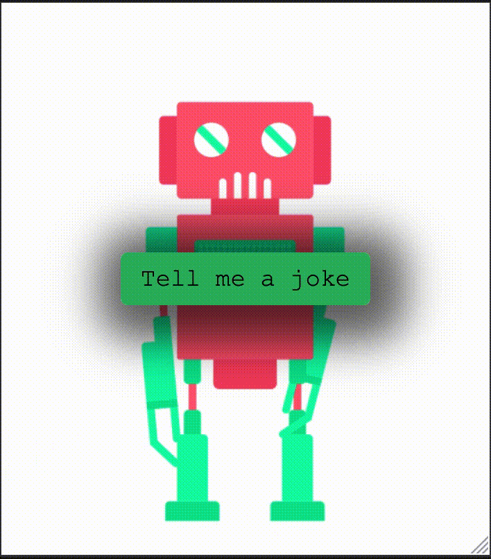

# Tell_a_joke

Tell a joke is an application utilizing two APIs. The VoiceRSS API and REST Joke API. The Joke API starts off the application with an async getJokes() to trigger the joke using the fetch method to parse in the API URL while the VoiceRSS API provides a response with audio data. The application generates a two-part joke; the joke and a response/delivery. 

To view the demo: **[click here](https://txt2speechapi.netlify.app/)**

# Functionality

To achieve this, we'll feed text that we get from our joke API and we want audio in return.

# Features

 Modern UI Design\
 One Page Layout\
 Styled with CSS3\
 Fully Responsive\
 Valid HTML5 & CSS3

# User story

AS A user, I WANT to be able to press the Tell Me a Joke button, and the button will tell me a random joke.
AND not be able to press the button again until the joke is done being told.

## Sources
https://www.voicerss.org/sdk/javascript.aspx
https://jokeapi.dev/#submit
https://www.w3schools.com/tags/ref_av_dom.asp
https://dart.dev/codelabs/async-await

# License

MIT License

Copyright (c) 2023 

Permission is hereby granted, free of charge, to any person obtaining a copy
of this software and associated documentation files (the "Software"), to deal
in the Software without restriction, including without limitation the rights
to use, copy, modify, merge, publish, distribute, sublicense, and/or sell
copies of the Software, and to permit persons to whom the Software is
furnished to do so, subject to the following conditions:

The above copyright notice and this permission notice shall be included in all
copies or substantial portions of the Software.

THE SOFTWARE IS PROVIDED "AS IS", WITHOUT WARRANTY OF ANY KIND, EXPRESS OR
IMPLIED, INCLUDING BUT NOT LIMITED TO THE WARRANTIES OF MERCHANTABILITY,
FITNESS FOR A PARTICULAR PURPOSE AND NONINFRINGEMENT. IN NO EVENT SHALL THE
AUTHORS OR COPYRIGHT HOLDERS BE LIABLE FOR ANY CLAIM, DAMAGES, OR OTHER
LIABILITY, WHETHER IN AN ACTION OF CONTRACT, TORT OR OTHERWISE, ARISING FROM,
OUT OF OR IN CONNECTION WITH THE SOFTWARE OR THE USE OR OTHER DEALINGS IN THE
SOFTWARE.